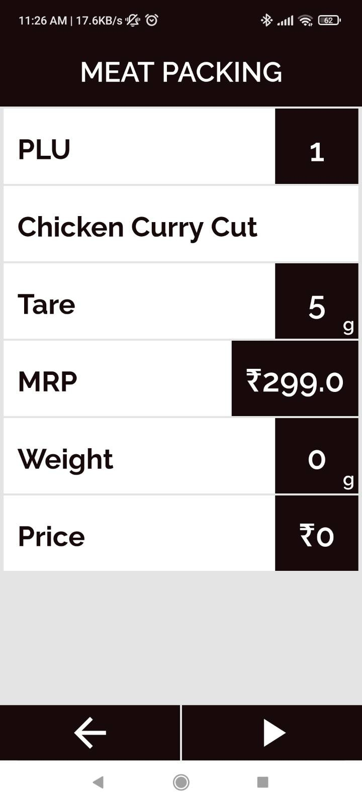
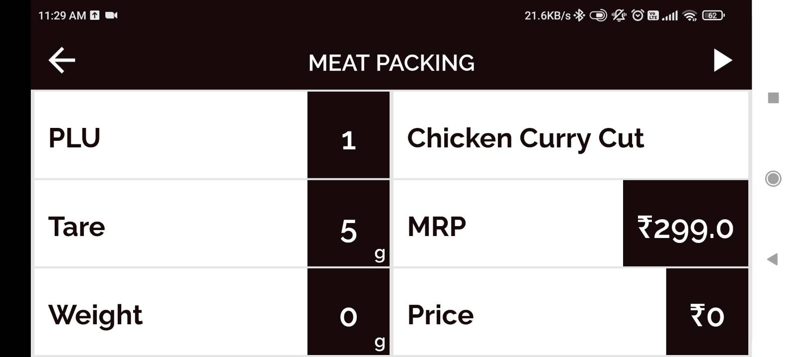

1. Build a responsive layout that works in both portrait and landscape modes. See images and video below for details.
2. Build the code and share screenshots and an APK. Also explain the approach you took and any specific issues you faced and debugged. 
3. Submit your repo and a brief note to [work@iotready.co](mailto:work@iotready.co)

