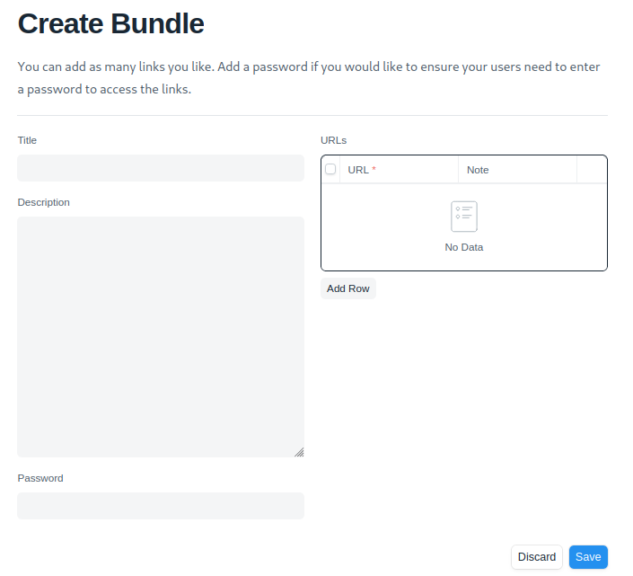
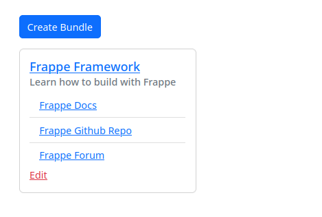

> This is an advanced challenge that will potentially need a full day for completion unless you are already familiar with Frappe.

 This challenge is meant for full-time Python developers. Interns can apply by completing the [Jinja challenge](../python-web/README.md).
 The challenge needs to be submitted by 27th May 2023, 8 pm.
 We are looking to see your approach, not the final output. Make sure you document your process and workflow as much as you can

## Assignment

1. Use [Frappe Framework](https://frappeframework.com) to build a simple link bundler app as described below.
2. The app has 2 pages: `Create` and `View`.
3. In the `Create` page, a logged in user can add links and create a bundle. See screenshot below.
4. Creating a bundle generates a view link. The user can share this link with a non-logged in user who can view the bundle and click on the links to open in a new browser tab/window. See screenshot below.
5. Stretch goals:
   1. The creator should be able to add a password to the bundle. The viewer will then need to type the password to access the bundle.
   2. The user who created the bundle should be able to edit the bundle.
6. Submit your repo to [work@seagate.co](mailto:work@seagate.co)

## Notes

- You will need GNU/Linux to install and run Frappe. Windows is not supported and WSL may not work.
- You can share your repo and screenshots. We do not expect you to host this application on the cloud.
- You can open source or otherwise use what you build without any restrictions.

## References

- [Frappe Docs](https://frappeframework.com/docs/)
- [Frappe Github Repo](https://github.com/frappe/frappe/)
- [Frappe Course](https://frappe.school/courses/frappe-framework-course)
- [Frappe Forum](https://discuss.frappe.io/)
