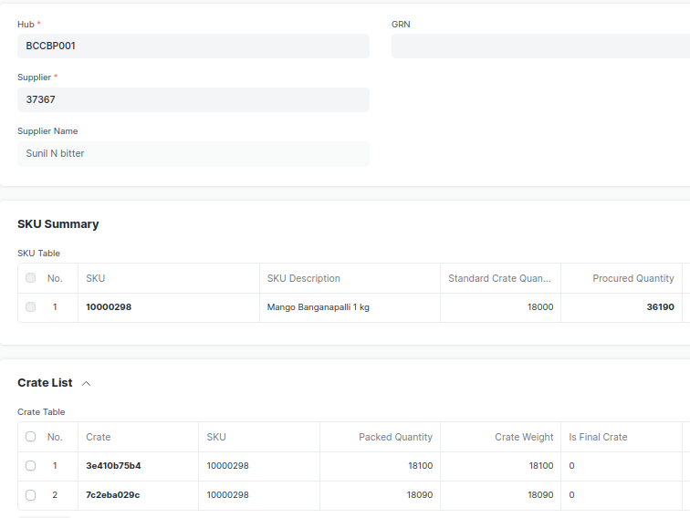

1. Use [Jinja](https://jinja.palletsprojects.com/en/3.1.x/) and [jinja-cli](https://github.com/cykerway/jinja-cli) to build a html view as described below.
2. The data is contained in [this JSON file](media/data.json). 
3. The HTML UI is shown in the image below.
4. Submit your repo and what **you** think is best thing about the web to [work@iotready.co](mailto:work@iotready.co)

